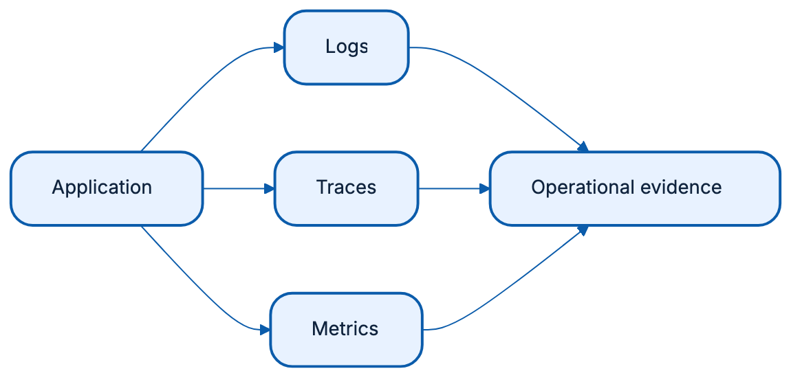
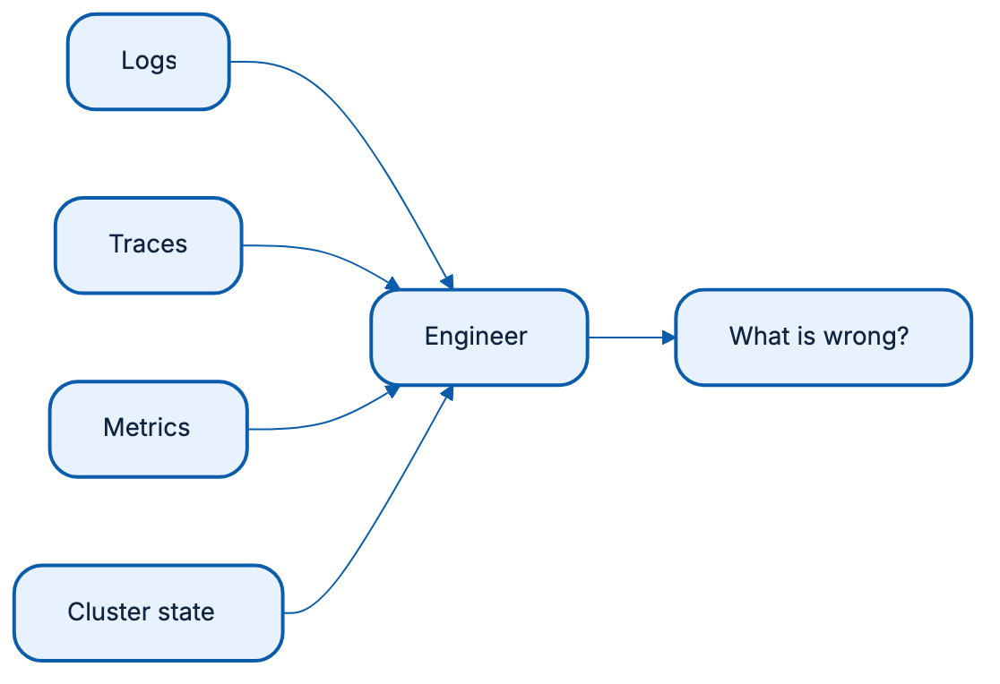
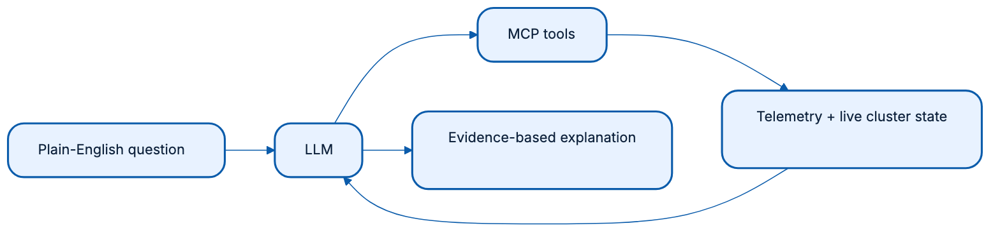
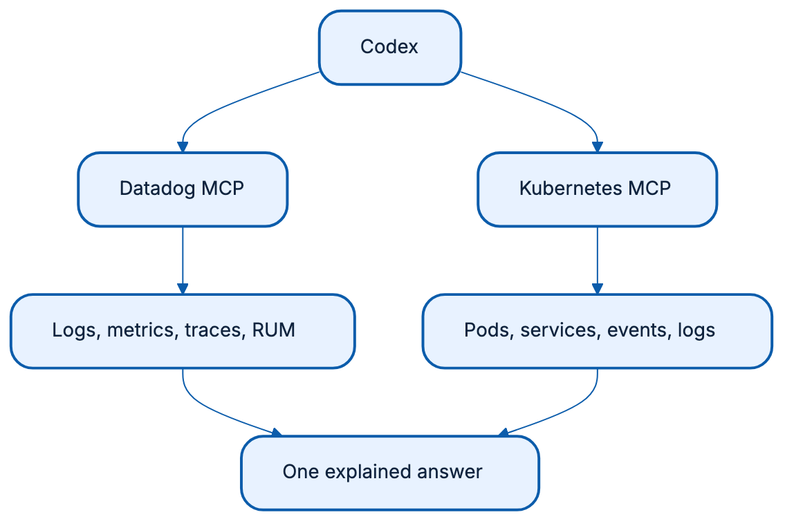

<!-- Render with: npx @marp-team/marp-cli PRESENTATION.md --allow-local-files -->

<!-- _class: lead -->
<!-- _paginate: false -->

# From observability to explainability with Datadog & Kubernetes MCP

---

# Observability shows what happened

- **Logs** record events
- **Traces** follow a request
- **Monitoring** shows health and trends

---

# Signals are not yet answers
- Human needs to connect the dot

---

# LLMs add explainability

- Ask in plain language
- Collect relevant evidence
- Explain likely cause and next step

---

# The Storedog demo

**Goal:** understand a running system and find faults sooner.

---

# Demo 1: get the baseline

> Show CPU and memory usage for Dogshop pods as a Markdown table. Add a simple comparison chart, highlight the three busiest pods, then inspect recent traffic-generator logs for errors. Do not make changes.

---

# Demo 2: ads are unavailable

Run this first `make fault SCENARIO=service-selector` and then send the prompt

**Prompt**

> Why are Dogshop ads unavailable? Correlate the service, endpoints, pods, events, and Datadog signals. Show the evidence in a table, fix the cause, and verify recovery.

---

# Demo 3: one cross-system summary

**Prompt**

> Use Kubernetes MCP to summarize Dogshop workload health and Datadog MCP to find relevant monitors or telemetry. Return one incident-summary table with evidence, impact, and recommended action. Perform read-only operations only.

---

# Other useful questions

- "Which workload has an image pull failure? Explain the warning events and repair it."
- "Why is the frontend rollout not completing? Inspect the failed readiness probe."
- "Scale ads to three replicas and verify the rollout."
- "Delete one ads pod and verify that the Deployment recovers."

---

# Closing remarks

- Observability gives us evidence
- MCP gives an LLM controlled access to that evidence
- Explainability helps teams understand and respond sooner
